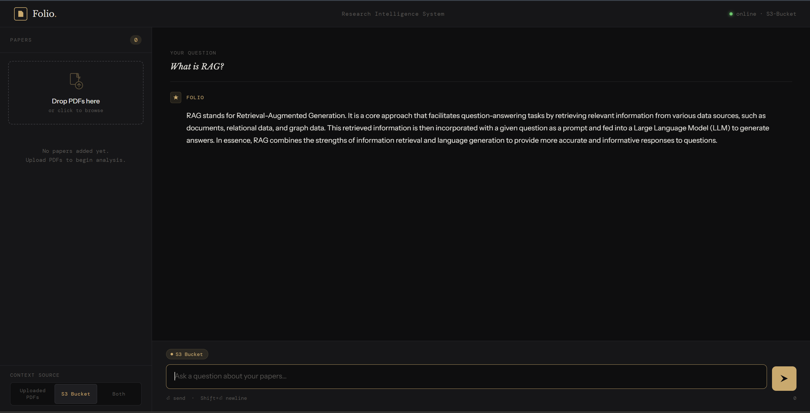

# Folio — Research Intelligence

A local RAG (Retrieval-Augmented Generation) application for analyzing research papers. Upload PDFs directly in the browser or connect to an S3 bucket, then ask questions across your documents using a LangGraph-orchestrated pipeline.

---



## Project Structure

```
graph-rag-app/
├── client/
│   └── index.html          # Frontend UI (served by Flask)
└── server/
    ├── storage/            # Persisted vector index (auto-generated, gitignored)
    ├── .env                # Your local environment variables (gitignored)
    ├── .example.env        # Environment variable template
    ├── app.py              # Flask server + LangGraph RAG pipeline
    ├── requirements.txt    # Python dependencies
    └── util_getgroqmodels.py
```

---

## Tech Stack

| Layer | Technology |
|---|---|
| **LLM** | [Groq](https://groq.com/) — `llama-3.3-70b-versatile` (fast inference) |
| **Embeddings** | HuggingFace — `BAAI/bge-small-en-v1.5` (local, no API key needed) |
| **RAG Framework** | [LlamaIndex](https://www.llamaindex.ai/) — document ingestion, vector indexing, query engine |
| **Orchestration** | [LangGraph](https://langchain-ai.github.io/langgraph/) — stateful `retrieve → generate` workflow |
| **Document Storage** | AWS S3 (remote) + local `storage/` directory (persisted index cache) |
| **PDF Uploads** | Browser FileReader API → base64 → in-memory LlamaIndex index |
| **Backend** | Flask (Python) |
| **Frontend** | Vanilla HTML/CSS/JS — no build step required |

---

## Running Locally

### 1. Prerequisites

- Python 3.10+
- A [Groq API key](https://console.groq.com/) (free tier available)
- AWS credentials with S3 read access *(only required if using S3 as context source)*

### 2. Set up environment variables

Copy `.example.env` to `.env` inside the `server/` directory and fill in your values:

```bash
cp server/.example.env server/.env
```

```env
# server/.env

ENV_HEALTH = True
FLASK_PORT=5000  #Local development port. Change if deploying to a platform that requires a specific port.
GROQ_API_KEY = "" #Replace with your actual GROQ API key


S3_URI = "" #Example: s3://your-bucket-name/your-folder/
AWS_ACCESS_KEY_ID = "" #Replace with your actual AWS Access Key. 
AWS_SECRET_ACCESS_KEY = "" #Replace with your actual AWS Secret Key. 
S3_BUCKET_NAME = "" #Replace with your actual S3 bucket name. This is the bucket where your documents will be stored.
S3_PREFIX = "" # The folder inside your bucket
AWS_REGION = "eu-north-1" # Your AWS from AWS Site. This can change per your bucket's region. Example: us-west-2
```

### 3. Install dependencies

```bash
cd server
pip install -r requirements.txt
```

> **Note:** First run will download the `BAAI/bge-small-en-v1.5` embedding model (~130 MB) from HuggingFace. This is cached locally after the first download.

### 4. Start the server

```bash
python app.py
```

The app will be available at **http://localhost:{PORT}**

 where `{PORT}` is the value set in `.env`.
---

## How It Works

Each question triggers a two-node LangGraph workflow:

```
User Question
      │
  [ retrieve ]  ──→  queries uploaded PDFs and/or S3 index
      │
  [ generate ]  ──→  Groq LLM synthesizes a final answer
      │
   Response
```

**Context sources** (selectable in the UI):

- **Uploaded PDFs** — PDFs dropped into the browser are base64-encoded, sent to the server, decoded into a temporary directory, indexed in-memory per request, and discarded after the response.
- **S3 Bucket** — On first query, documents are pulled from S3 and a vector index is built and persisted to `server/storage/`. Subsequent queries load from disk (fast).
- **Both** — Retrieves from both sources and merges the context before generation.

---

## API Reference

### `GET /`
Serves the frontend (`client/index.html`).

### `GET /health`
Returns server status.
```json
{ "status": "online", "source": "S3-Bucket" }
```

### `POST /response`
Run a RAG query.

**Request body:**
```json
{
  "question": "What methodology was used?",
  "pdf_files": [
    { "name": "paper.pdf", "data": "<base64-encoded-pdf>" }
  ],
  "use_s3": false
}
```

`pdf_files` and `use_s3` are both optional. If neither is provided, `use_s3` defaults to `true`.

**Response:**
```json
{
  "status": "success",
  "response": "The paper uses a mixed-methods approach..."
}
```

---

## Notes

- The S3 index is cached in `server/storage/`. To force a re-index (e.g. after adding new documents to S3), delete that directory and restart the server.
- PDF uploads are **not persisted** — they are indexed in memory per-request. Re-upload them after a page refresh.
- The embedding model runs entirely locally — no data is sent to external services except the final prompt to Groq.

